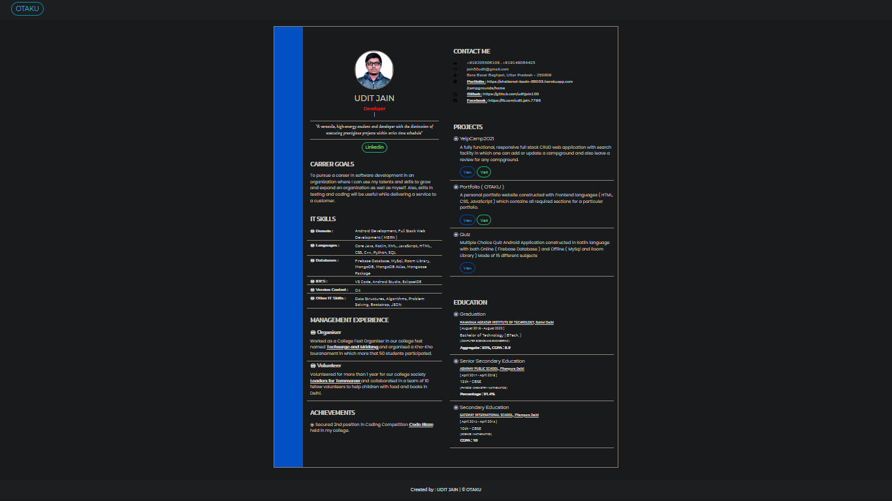

# 📄 Resume Web Project

This project is a stylish, responsive **Resume Builder Website** developed using **HTML**, **CSS**, **JavaScript**, and **PHP**. It allows users to view a dynamic and professional resume in a web format with integrated profile details, career objectives, technical skills, and project links. It's ideal for developers or students showcasing their profiles online.

---

## 🚀 Features

- ✨ Animated profile subtitles using [Typed.js](https://github.com/mattboldt/typed.js/)
- 🖼️ Responsive layout built with **Bootstrap 5**
- 🎨 Styled using custom CSS and Google Fonts
- 🧾 Well-structured Resume with:
  - Contact Info
  - Education
  - Projects (with links to GitHub and live demos)
  - IT Skills and Tools
  - Achievements & Career Goals
- 📸 Profile image integration
- 💻 PHP backend (basic setup for potential future form submission)

---

## 🛠️ Tech Stack

| Technology   | Usage                           |
| ------------ | ------------------------------- |
| HTML5        | Structure                       |
| CSS3         | Styling                         |
| JavaScript   | Interactivity (Typed.js)        |
| PHP          | Backend (index.php placeholder) |
| Bootstrap    | Responsive Design               |
| Google Fonts | Typography                      |

---

## 📂 Project Structure

```
📁 Resume-Builder/
├── index.html         # Main resume layout
├── app.css            # Custom styles
├── app.js             # JS for animated typing
├── index.php          # PHP integration
├── profile.jpg        # Profile picture
├── Resume.png         # Screenshot for README
```

---

## 📸 Screenshot

Below is a screenshot of the resume generated:



> ✅ The resume is fully responsive and loads beautifully across devices.

---

## 📌 How to Use

1. Clone the repository:

   ```bash
   git clone https://github.com/your-username/resume-builder.git
   cd resume-builder
   ```

2. Open `index.html` in any browser to view the resume.

3. Optionally, run with PHP if backend features are added:
   ```bash
   php -S localhost:8000
   ```

---

## 🧑‍💻 Author

**Udit Jain**

- 🔗 [LinkedIn](https://linkedin.com/in/udit-jain-8a38a016a/)
- 🐙 [GitHub](https://github.com/uditjain100)

---
